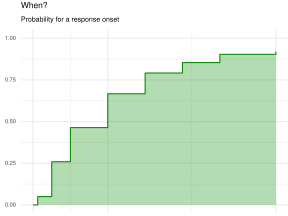
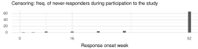
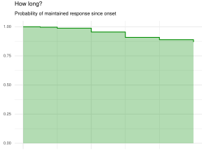
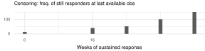
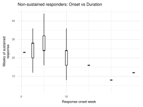
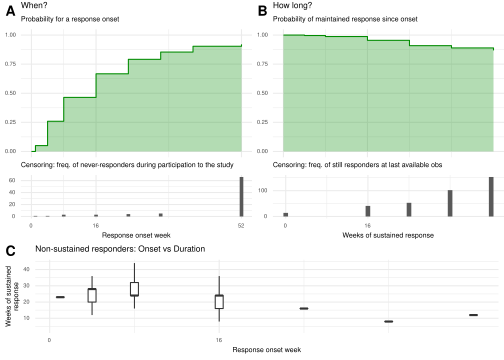

Study 1
================
FCollin
03 Nov 2021

``` r
file_nm <- "inst/rcode/study.R"
knitr::read_chunk(file_nm)
message("R code chunks read from:\n", file_nm)
#> R code chunks read from:
#> inst/rcode/study.R
```

``` r
devtools::load_all()
#> ℹ Loading analysis.pack
library(dplyr)
#> 
#> Attaching package: 'dplyr'
#> The following objects are masked from 'package:stats':
#> 
#>     filter, lag
#> The following objects are masked from 'package:base':
#> 
#>     intersect, setdiff, setequal, union
library(ggplot2)
```

``` r
prepare_adam_pasi() %>%
  attach()

# Analysis dataset
ads <- adsl %>%
  select(USUBJID, ARMCD) %>%
  left_join(adpasi) %>%
  filter(PARAMCD == "PASITOT") %>%
  rename(
    subj = USUBJID,
    pasi = AVAL,
    grp = ARMCD,
    week = AVISIT
  ) %>%
  mutate(
    time = gsub("^WEEK(.*)$", week, replacement = "\\1"),
    time = as.numeric(time)
  ) %>%
  select(subj, grp, week, pasi, time) %>%
  arrange(subj, time) %>%
  as_tibble()
#> Joining, by = "USUBJID"
```

``` r
ads
#> # A tibble: 8,100 × 5
#>    subj        grp   week    pasi  time
#>    <chr>       <fct> <chr>  <dbl> <dbl>
#>  1 SUBJECT 001 ARM B WEEK00  27       0
#>  2 SUBJECT 001 ARM B WEEK01  22.5     1
#>  3 SUBJECT 001 ARM B WEEK04  18.2     4
#>  4 SUBJECT 001 ARM B WEEK08   8.8     8
#>  5 SUBJECT 001 ARM B WEEK16   4.2    16
#>  6 SUBJECT 001 ARM B WEEK24   1      24
#>  7 SUBJECT 001 ARM B WEEK32   0      32
#>  8 SUBJECT 001 ARM B WEEK40   0      40
#>  9 SUBJECT 001 ARM B WEEK52   0      52
#> 10 SUBJECT 002 ARM B WEEK00  23.2     0
#> # … with 8,090 more rows
```

``` r
# Last Observation Carried Forward, adapated from `zoo::na.locf`.
locf <- function(y) {

  ok <- which(!is.na(y))
  if (is.na(y[1L])) ok <- c(1L, ok)
  gaps <- diff(c(ok, length(y) + 1L))
  rep(y[ok], gaps)

}

# Next Observation Carried Backward derived from locf.
nocb <- function(y) rev(locf(rev(y)))

apply_ifany <- function(x, cond, fun = min, otherwise = Inf) {
  if (any(cond)) do.call(fun, list(x[cond]))
  else otherwise
}

pasi_fun <- function(x) {
  y <- cut(
    x,
    breaks = c(-Inf, 0, 2, 3, Inf),
    labels = c("PASI = 0", "PASI <= 2", "PASI <= 3", "PASI > 3"),
    include.lowest = TRUE
  )
  y <- factor(y, levels = c(levels(y), "Lost Response", "Missing"))
  y[is.na(y)] <- "Missing"
  y
}
```

``` r
theme_spin <- function(...) {
  theme_minimal() +
    theme(
      text = element_text(size = 7),
      title = element_text(size = 7)
    ) +
    theme(...)
}

StatStepArea <- ggproto(# nolint - ggplot syntax
  "StatStepArea", Stat,
  compute_group = function(data, scales) {
    data <- as.data.frame(data)[order(data$x), ]
    n <- nrow(data)
    if (n <= 1) {
      # Need at least one observation
      return(data[0, , drop = FALSE])
    }
    ys <- rep(1:n, each = 2)[-2 * n]
    xs <- c(1, rep(2:n, each = 2))
    x <- data$x[xs]
    y <- data$y[ys]
    data_attr <- data[xs, ]
    data_attr$x <- x
    data_attr$y <- y
    data_attr$ymin <- 0
    data_attr$ymax <- y
    y <- data_attr
    y
  },
  required_aes = c("x", "y")
)

stat_steparea <- function(mapping = NULL,
                          data = NULL,
                          geom = "area",
                          position = "identity",
                          na_rm = FALSE,
                          show_legend = NA,
                          inherit_aes = TRUE,
                          ...) {
  layer(
    stat = StatStepArea, data = data, mapping = mapping, geom = geom,
    position = position, show.legend = show_legend, inherit.aes = inherit_aes,
    params = list(na.rm = na_rm, ...)
  )
}
```

``` r
ads <- ads %>%
  group_by(subj) %>%
  mutate(
    rsp = nocb(pasi),
    nocbfl = is.na(pasi) & !is.na(rsp),
    # PASI Categories
    pasic = pasi_fun(rsp),
    # First time lower than pasi <= 2
    crsp_onset = apply_ifany(time, rsp <= 2 & !is.na(rsp)),
    # First wk after wk onset when pasi > 2
    crsp_end = apply_ifany(time, rsp > 2 & !is.na(rsp) & time > crsp_onset),
    rsp = factor(
      ifelse(time >= crsp_end, "Lost Response", as.character(pasic)),
      levels = levels(pasic)
    ),
    subset = case_when(
      all(crsp_onset == Inf) ~ "Never\nresponder",
      all(crsp_onset < Inf & crsp_end > 52) ~ "Continuous\nresponder",
      all(crsp_onset < Inf & crsp_end < Inf) ~ "Non-sustained\nresponder"
    )
  ) %>%
  ungroup() %>%
  mutate(subj = factor(subj, levels = unique(subj[order(-1 * crsp_onset)])))
```

``` r
ads
#> # A tibble: 8,100 × 11
#>    subj   grp   week   pasi  time rsp   nocbfl pasic crsp_onset crsp_end subset 
#>    <fct>  <fct> <chr> <dbl> <dbl> <fct> <lgl>  <fct>      <dbl>    <dbl> <chr>  
#>  1 SUBJE… ARM B WEEK…  27       0 PASI… FALSE  PASI…         24      Inf "Conti…
#>  2 SUBJE… ARM B WEEK…  22.5     1 PASI… FALSE  PASI…         24      Inf "Conti…
#>  3 SUBJE… ARM B WEEK…  18.2     4 PASI… FALSE  PASI…         24      Inf "Conti…
#>  4 SUBJE… ARM B WEEK…   8.8     8 PASI… FALSE  PASI…         24      Inf "Conti…
#>  5 SUBJE… ARM B WEEK…   4.2    16 PASI… FALSE  PASI…         24      Inf "Conti…
#>  6 SUBJE… ARM B WEEK…   1      24 PASI… FALSE  PASI…         24      Inf "Conti…
#>  7 SUBJE… ARM B WEEK…   0      32 PASI… FALSE  PASI…         24      Inf "Conti…
#>  8 SUBJE… ARM B WEEK…   0      40 PASI… FALSE  PASI…         24      Inf "Conti…
#>  9 SUBJE… ARM B WEEK…   0      52 PASI… FALSE  PASI…         24      Inf "Conti…
#> 10 SUBJE… ARM B WEEK…  23.2     0 PASI… FALSE  PASI…         16      Inf "Conti…
#> # … with 8,090 more rows
```

``` r
library(survival)

data <- ads %>%
  group_by(subj) %>%
  mutate(wk_last = max(time[rsp != "Missing"])) %>%
  ungroup() %>%
  distinct(subj, crsp_onset, wk_last, crsp_end) %>%
  mutate(
    km_rsp_1 = crsp_onset < Inf,
    time_1 = ifelse(crsp_onset < wk_last, crsp_onset, wk_last),
    km_rsp_2 = crsp_end < Inf,
    time_2 = ifelse(crsp_end < wk_last, crsp_end, wk_last) - crsp_onset
  )

data
#> # A tibble: 900 × 8
#>    subj        crsp_onset crsp_end wk_last km_rsp_1 time_1 km_rsp_2 time_2
#>    <fct>            <dbl>    <dbl>   <dbl> <lgl>     <dbl> <lgl>     <dbl>
#>  1 SUBJECT 001         24      Inf      52 TRUE         24 FALSE        28
#>  2 SUBJECT 002         16      Inf      52 TRUE         16 FALSE        36
#>  3 SUBJECT 003        Inf      Inf      16 FALSE        16 FALSE      -Inf
#>  4 SUBJECT 004          4      Inf      52 TRUE          4 FALSE        48
#>  5 SUBJECT 005         32      Inf      52 TRUE         32 FALSE        20
#>  6 SUBJECT 006         24      Inf      52 TRUE         24 FALSE        28
#>  7 SUBJECT 007          8      Inf      52 TRUE          8 FALSE        44
#>  8 SUBJECT 008          8      Inf      52 TRUE          8 FALSE        44
#>  9 SUBJECT 009          4      Inf      52 TRUE          4 FALSE        48
#> 10 SUBJECT 010         16      Inf      52 TRUE         16 FALSE        36
#> # … with 890 more rows

surv_mod <- survfit(Surv(time_1, km_rsp_1) ~ 1, data = data)
dta_gg <- summary(
  surv_mod, time = unique(ads$time)
)[c("time", "n.censor", "surv")] %>%
  as_tibble() %>%
  mutate(y =  1 - surv)

dta_gg
#> # A tibble: 9 × 4
#>    time n.censor   surv      y
#>   <dbl>    <dbl>  <dbl>  <dbl>
#> 1     0        0 1      0     
#> 2     1        1 0.95   0.0500
#> 3     4        1 0.741  0.259 
#> 4     8        3 0.536  0.464 
#> 5    16        3 0.333  0.667 
#> 6    24        4 0.208  0.792 
#> 7    32        5 0.146  0.854 
#> 8    40        0 0.0964 0.904 
#> 9    52       66 0.0796 0.920
```

``` r
gg1 <- dta_gg %>%
  ggplot(aes(x = time, y = y)) +
  geom_step(col = "green4") +
  stat_steparea(fill = "green4", alpha = .3) +
  scale_x_continuous(breaks = c(0, 16, 52)) +
  coord_cartesian(ylim = c(0, 1), xlim = c(0, 52)) +
  labs(
    title = "When?",
    subtitle = "Probability for a response onset"
  ) +
  theme_spin(
    axis.title = element_blank(),
    axis.text.x = element_blank(),
    plot.margin = margin(2, 0, 0, 5)
  )

gg1
```



``` r
gg2 <- dta_gg %>%
  ggplot(aes(x = time, y = n.censor)) +
  geom_bar(stat = "identity") +
  scale_x_continuous(breaks = c(0, 16, 52)) +
  coord_cartesian(xlim = c(0, 52)) +
  xlab("Response onset week") +
  labs(
    subtitle =
      "Censoring: freq. of never-responders during participation to the study"
  ) +
  theme_spin(
    plot.margin = margin(2, 0, 0, 5),
    axis.title.y = element_blank()
  )

gg2
```



``` r
surv_mod <- survfit(Surv(time_2, km_rsp_2) ~ 1, data = data[data$km_rsp_1, ])
dta_gg <- summary(
  surv_mod, time = unique(ads$time)
)[c("time", "n.censor", "surv")] %>%
  as_tibble() %>%
  mutate(y = surv)
```

``` r
gg3 <- dta_gg %>%
  ggplot(aes(x = time, y = y)) +
  geom_step(color = "green4") +
  stat_steparea(fill = "green4", alpha = .3) +
  scale_x_continuous(breaks = c(0, 16, 52)) +
  coord_cartesian(ylim = c(0, 1)) +
  labs(
    title = "How long?",
    subtitle = "Probability of maintained response since onset"
  ) +
  theme_spin(
    axis.title = element_blank(),
    axis.text.x = element_blank(),
    plot.margin = margin(2, 0, 0, 5)
  )

gg3
```



``` r
gg4 <- dta_gg %>%
  ggplot(aes(x = time, y = n.censor)) +
  geom_bar(stat = "identity") +
  scale_x_continuous(breaks = c(0, 16, 52)) +
  scale_y_continuous(breaks = c(0, 100, 250)) +
  xlab("Weeks of sustained response") +
  labs(
    subtitle = "Censoring: freq. of still responders at last available obs"
  ) +
  theme_spin(
    plot.margin = margin(2, 0, 0, 5),
    axis.title.y = element_blank()
  )

gg4
```



``` r
data <- ads %>%
  group_by(subj) %>%
  mutate(wk_last = max(week[rsp != "Missing"])) %>%
  ungroup() %>%
  distinct(subj, crsp_onset, wk_last, crsp_end) %>%
  mutate(
    km_rsp_1 = crsp_onset < Inf,
    time_1 = ifelse(crsp_onset < wk_last, crsp_onset, wk_last),
    km_rsp_2 = crsp_end < Inf,
    time_2 = ifelse(crsp_end < wk_last, crsp_end, wk_last) - crsp_onset,
    duration = time_2
  )

gg5 <- data %>%
  filter(duration > 0, crsp_end < Inf) %>%
  mutate(censored = crsp_end == Inf) %>%
  ggplot(aes(x = crsp_onset, y = duration)) +
  geom_boxplot(aes(group = crsp_onset), outlier.shape = NA) +
  scale_x_continuous(breaks = c(0, 16, 52)) +
  xlab("Response onset week") +
  ylab("Weeks of sustained\nresponse") +
  labs(title = "Non-sustained responders: Onset vs Duration") +
  scale_fill_viridis_c() +
  theme_spin()

gg5
```



``` r
gg <- cowplot::plot_grid(
  cowplot::plot_grid(
    gg1, gg3, gg2, gg4,
    align = "v",
    ncol = 2,
    rel_heights = c(3, 1.5),
    labels = c("A", "B")
  ),
  gg5,
  ncol = 1,
  rel_heights = c(2, 1),
  labels = c(NA, "C")
)

gg
#> Warning: Removed 1 rows containing missing values (geom_text).
```


